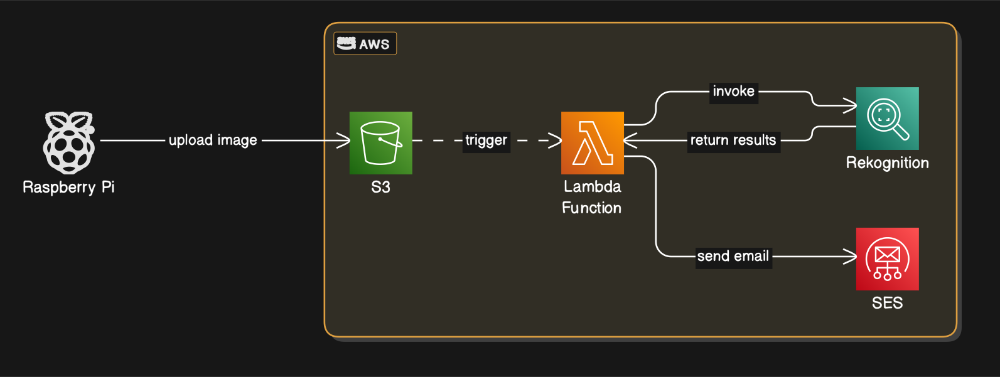

# PostOne
PostOne is a Smart Mailbox. When the mailbox door opens, an image is taken of the person who opened it, and an email is sent to a user that their mailbox has been opened, as well as whether or not the person who opened it is a recognized user. 

## AWS

## CAD Model

